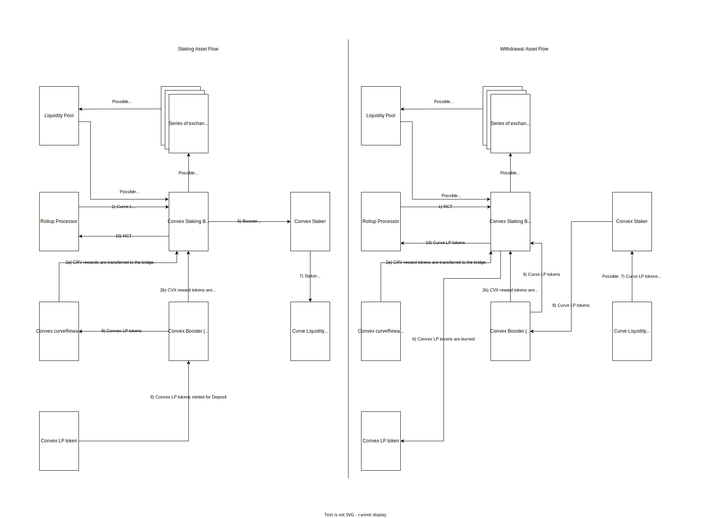

# Spec for Convex Staking Bridge

## What does the bridge do? Why build it?

The bridge stakes Curve LP tokens via Convex Finance. Convex Finance Booster stakes Curve LP tokens provided by the user and mints its own pool specific Convex LP tokens for the user to keep track of the staked Curve LP tokens and the earned rewards.

The advantage of staking on Convex Finance over Curve Finance is that the user earns boosted CRV rewards right away and can withdraw the staked tokens any time. On top of this, the user earns CVX (Convex tokens) and at some pools even additional rewards.

Bridge can interact with 10 selected Convex pools. These pools were determined based on ability of supported Aztec assets to interact with Curve pools and thus earning Curve LP tokens and the pool significance (metric TVL).

## What protocol(s) does the bridge interact with ?

The bridge interacts with two protocols. Primarily with Convex Finance that operates with the given Curve LP tokens on Curve.

[Convex Finance](https://www.convexfinance.com/) is a protocol built on top of Curve to make yield farming much easier and to automatically get boosted rewards. Convex Finance allows staking of CRV tokens or Curve LP tokens on Curve Finance without the need to lock user's CRV away and the user can start earning boosted CRV right away. This bridge only works for staking of Curve LP tokens.
Note: Convex Finance has its own governance token CVX which user earns as part of staking.

[Curve](https://curve.fi/) is a AMM that specializes in pools with low internal volatility (stableswap). Curve Finance provides us with many LPs to which a user may provide liquidity and earn rewards. Rewards are paid out in tokens specific to the LP and/or pool specific `Curve LP tokens`. To be able to utilize the full potential of the earned LP tokens, it is necessary to stake them. Here comes in play Convex Finance.

## What is the flow of the bridge?

There are two flows of Convex staking bridge, namely deposits and withdrawals. It is necessary to mention that both flows work with pool specific Representing Convex Token (RCT) that is deployed for each pool on its loading.
Interesting fact is that both flows work with different number of assets. Deposit work with a single input asset and a single outputAsset while Withdraw works with a single input asset and two output assets.

### Deposit (Staking)

TL;DR: Bridge stakes Curve LP tokens into Curve pool liquidity gauge contract via Convex Finance Booster. Subsequently new Convex LP tokens of the corresponding pool are minted in 1:1 ratio and transferred to curveRewards contract. Bridge mints pool specific RCT token proportionally to the user's staked Curve LP tokens in 1e10 : 1 ratio. RCT tokens are recoved by Rollup Processor.

Before user starts with the deposit, it is necessary to ensure that the pool for the given assets has already been loaded.

Bridge expects Curve LP token on input and RCT token on output in order to perform deposit. Curve LP tokens are transferred from Rollup Processor to the bridge. Bridge checks if the provided RCT token has been already deployed and whether it was deployed for the same pool as the provided Curve LP token. If these conditions are met, deposit may proceed. Bridge finds the correct pool that corresponds to the Curve LP token on input. 
Next, bridge checks if there are any Curve LP tokens owned by the bridge that were not staked yet. This can happen after withdrawal when earned rewards are converted to Curve LP tokens but not staked. Then, bridge claims rewards and tries to convert them to Curve LP tokens (Note 1). Convex Finance has a Booster contract that operates across all the pools. Booster handles the complete deposit (staking) process and is approved to manage bridge's Curve LP tokens. First, it transfers all Curve LP tokens from the bridge into Staker contract that then stakes them to Liquidity Gauge of the specific pool. New Convex LP tokens are minted, representing the staked LP tokens in Convex Finance in 1:1 ratio. Convex LP tokens are transferred to Convex curveRewards contract. CurveRewards is now in possession of the minted Convex LP tokens and through them keeps track of the staked Curve LP tokens for the bridge (or any other staking user). RCT tokens are minted proportionally to the user's deposit (Note 2). Eventually, the minted RCT tokens are recover by the Rollup Processor.

Note 1: On each deposit, the bridge pulls earned rewards and if there is sufficient amount accumulated, it will convert them to Curve LP tokens that are staked along with the user's about to be deposited Curve LP tokens and Curve LP tokens present in the bridge from before the interaction. If not sufficient amount of rewards has accumulated, the rewards are owned by the bridge until they can be exchanged for Curve LP tokens and staked again. What this does is that rewards are proportionally paid out to the user on withdrawal and it reflects the staked amount by the user and the length of staked tokens. 

Note 2: RCT starts off to represent the minted Convex LP tokens (staked Curve LP tokens) in 1e10:1 ratio (Note 3), however, as rewards are converted to Curve LP tokens and staked, this ratio slightly changes. Nevertheless, the RCT tokens still represent the exact amount of the user's deposit to all Curve LP tokens (already minted and potentially minted Convex LP tokens when converted rewards are staked). So RCT still in a way represents Convex LP token.

Note 3: Read more about the reason for 1e10 : 1 ratio in "Introduction of inflation protection mechanism" section

RCT exists to enable Rollup Processor to properly perform deposits and withdrawals for different users at different times. Rollup Processor expects to work with at least one input and one output asset and both assets need to be able to be owned by it. Because minted Convex LP tokens are only indirectly owned by the bridge and the actual ownership is given to curveRewards contract, Convex LP token cannot be transferred back to the Rollup Provider. Contrary to this, RCT token is fully owned by the bridge and can be transferred elsewhere.

Gas cost of a deposit varies based on the pool. Costs mostly fluctuate in range 750k to 950k. This does not include the transfers to/from the Rollup Processor.

**Edge cases**:

- If pool is not loaded, deposit to this pool will fail
- Convex Finance has to support the Curve LP token user is trying to stake. If no pool matches the provided Curve LP token, no staking will happen.
- Staking amount cannot be zero.
- Pool can be shut down and no staking will happen

### Withdrawal (Unstaking)

TL;DR: Rollup Processor transfers RCT tokens to the bridge. Bridge claims rewards and converts them to Curve LP tokens. Next, it withdraws corresponding amount of staked Curve LP tokens via Booster and direct interaction with curveRewards contract. Booster burns Convex LP tokens and returns staked Curve LP tokens to the bridge. RCT tokens are burned, returned Curve LP tokens are recovered by Rollup Processor.

Before user starts with withdrawal, it is necessary to ensure that the pool for the given assets has already been loaded.

Bridge expects RCT token on input and Curve LP token on output to perform withdrawal. Rollup Processor transfers RCT tokens to the bridge. Then a check is performed whether the pool for the given assets has already been loaded and the RCT token has already been deployed. Next check assures that the input and output tokens belong to the same pool. If the check passes, it searches for the right pool. In the next step, the bridge claims earned rewards and exchanges them for Curve LP token if sufficient amount is present. Followed by a calculation of how many Curve LP tokens is represented by the amount of RCT tokens on input and will be withdrawn. It continues with withdrawal of Curve LP tokens. The bridge calls curveRewards contract to transfer the Convex LP tokens to the bridge. Next, the bridge calls the Booster to withdraw the deposited Curve LP tokens. It starts by burning the Convex LP tokens, then retrieves Curve LP tokens from Staker contract. If sufficient funds are not available, Staker pulls more deposited Curve LP tokens from the specific Curve pool liquidity gauge contract. Desired amount of Curve LP tokens is then retrieved and transferred back to the bridge (Note 4). Finally, RCT tokens are burned and Rollup Processor recovers the Curve LP tokens.

Note 4: Caveat - read section Swapping and staking rewards and drawbacks of the solution

Claimed rewards are the boosted CRV tokens, CVX tokens and for some pools some additional rewards. The most notable reward tokens - CRV and CVX - are swapped for Curve LP tokens and staked by the next deposit. Minimum amount required for the conversion to happen is set to 200 tokens, about $160 worth of rewards. If rewards cannot be converted, the rewards are still owned by the bridge sufficient amount has accumulated. Only CRV and CVX rewards are processed, additional rewards are not for their insignificance. 

Gas cost of a withdrawal varies based on the pool. Withdrawal costs about 1.4M when claimed rewards are not swapped and about 2.1M when they are. Swap costs about 650K. Costs include claim of subsidy but do not include the transfers to/from the Rollup Processor.

**Edge cases**

- If pool is not loaded, withdrawal from this pool will fail.
- Withdrawal impossible without staking tokens into the pool first.
- Withdrawal amount cannot be zero.

## Swapping (Exchange or conversion) and staking rewards and drawbacks of the solution
- Swapping of earned rewards for a pool specific token that can be deposited into a pool specific liquidity pool in order to earn pool specific Curve LP token is happening so the earned rewards are proportionally distributed among the staking users based on the amount staked and length of staking.
- Claiming rewards and potential exchange for Curve LP tokens happens on deposits as well as withdrawals. However, in order to **save gas**, staking of these Curve LP tokens only happens on deposits. The side effect of this is, that bridge owns these Curve LP tokens which makes the bridge stateful.
- More often than not though, the accumulated rewards (CRV, CVX) are too low for the exchange to be financially sane. A limit for exchange is 200 tokens for both (about $160). Since claimed amounts for both rewards are always identical, exchange will be performed for both at the same time or for none.
- Drawback of making bridge stateful is that tokens are left in the bridge even after the Rollup - bridge interaction and the bridge has approval to transfer these tokens up to max amount are subjected to potential theft. It makes the bridge susceptible to losing these rewards to a theft. However, it was decided that this risk-rewards ratio is financially optimal (saving of gas vs. losing up to $160 in rewards)
- Another drawback of the approach is that the Curve LP tokens in the bridge are used for the calculation of how many Curve LP tokens to withdraw. This may cause that the calculated amount is greater than the amount of actually staked Curve LP tokens and will revert. Workaround is to deposit a minimum amount of Curve LP tokens for the Curve LP tokens in the bridge to be staked and then withdraw the desired amount. Another approach is to simply withdraw less where the calculation will be less than the amount of actually staked tokens.
- Swapping routes were preselected for each pool by the dev and no slippage condition has been implemented, swaps will come through even on less favorable rates.

### General Properties for both deposit and withdrawal

- The bridge is synchronous, and will always return `isAsync = false`.
- The bridge does not use `auxData`.
- Bridge is stateful.
- Convert function ranges between 350K and 2M with average being 670K

## Can tokens balances be impacted by external parties, if yes, how?

- Either a single pool or all pools at the same time can be shut down. This can impact the balances of certain contracts where the tokens typically are, however, do not result in any tokens lost.

- A single pool can be shut down by Booster's Pool Manager contract (0x5F47010F230cE1568BeA53a06eBAF528D05c5c1B)
  Any interaction with a pool supported by Convex Finance can be shut down by Convex pool manager contract.
  Pool shutdown will force all tokens from Staker and Gauge contracts to be transferred to Booster. Withdrawals will not get impaired.
  Only the Staker's and Gauge's balances (including your share) are displaced.
  Note: Deposit will not be possible.

- All pools can be single handedly shut down by Booster's Owner contract (0x3cE6408F923326f81A7D7929952947748180f1E6)
  Does and allows exactly the same thing as shut down of a single pool described above, only for all the pools.

## Introduction of inflation protection mechanism
- SC is opened for `ERC4626 share price inflation` vulnerability in case of mixed accounting - internal (controlled by the bridge alone) and external (not controlled by the bridge, other entities can influence balances). Taken two precausions - setting minimum value for inital deposit and inflation of ratio between input and output token.
- Minimum initial value set to 1e16
- Inflation of ratio reduces the chance for attacker to dispose with sufficient financial means to take advantage of the users. Inflation was set to 1e10, meaning attacker would need to have, in the worse case scenario, 1e10 times more resources than what an average and minimum user's deposit is.
- RCT : Curve LP token = 1e10 : 1
- Both precausions work on the same basis, decreasing the chance of this attack by setting the necessary amount of tokens (money) to abuse this vulnerability very high (in other words attacker will not have enough money to exploit the vulnerability). In a combination with a devastating loss for the attacker, when a user deposits a regular amount. High risk of losing money and a potential of stealing very little is a great deterrent for most attackers.
- Initial deposit seriously affects inflation ratio for the first couple of deposits. For this reason, it is necessary to set it reasonably high to protect all users from the vulnerability
- It protects all users up to a certain degree. Most affected users by a potential attack are those staking significantly (and almost suspiciously) low deposits.
- Resetting inflation ratio -> vulnerability reopens - this can happen when a lot of staked tokens are withdrawn. Best strategy -> stake reasonably high amounts (bare minimum is 1 token (1e18) but ideally hundreds or thousands)

## Is the contract upgradeable?

No, the bridge is immutable without any admin role.

## Does the bridge maintain state?

Yes, it does. The bridge maintains state for Curve LP tokens and earned rewards. Curve LP tokens are owned by the bridge only after withdrawal if succifient amount of earned rewards has been accumulated for the conversion to Curve LP tokens via designated Curve pools tailored for each pool. 
Bridge also holds state for user's Curve LP token and minted RCT tokens during the interaction.
