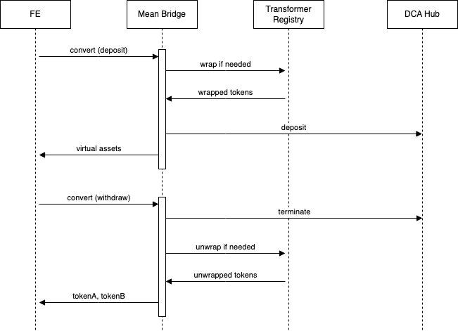

# Spec for Mean Finance Bridge

## What does the bridge do? Why did you build it?

The bridge allows a user to enter a DCA (Dollar Cost Average) position, selling one asset and buying another over a period of time.

## What protocol(s) does the bridge interact with?

The bridge interacts only with Mean Finance. In particular, we interact with two different contracts:
1. The DCA Hub: does everything related to DCAing
2. The Transformer Registry: can transform between wrapped tokens and their underlying tokens

Both are immutable. However, the Transformer Registry is in fact a registry and the Mean Finance team has the ability to modify entries

## What is the flow of the bridge?

The bridge is asynchronous and has two flows: the deposit + the withdraw.

### Deposit (L2)

When users create a DCA position, they must specify:
- The "from" token
- The "to" token
- Amount of "from" token
- Swap interval (daily, weekly, etc)
- Amount of swaps

Also, the bridge supports the ability to generate yield while the DCA position is executed (both on the "from" and "to" tokens)

### Withdraw/finalise (L1)

A position needs to be finalised before it can be exited.
For a position to be ready to be finalised, all its available funds must have been sold for the opposite asset.
When finalised, the accumulated funds will be returned to the bridge and the user may claim them on L2.

### Diagram

### Technical details
This is how we expect the data to be passed to the bridge:
- `inputAssetA` will represent the token that the user will deposit (for example DAI)
- `outputAssetA` will represent the token that the user will withdraw (for example ETH)
- `outputAssetB` will be the same as output `inputAssetA` (to support withdrawing unswapped funds)
- `auxData` will encode:
  - The amount of swaps
  - The swap interval
  - The wrapper for the "from" token
  - The wrapper for the "to" token

#### AuxData
The `auxData` field is 64bits long:
- First 24 bits: amount of swaps
- Next 8 bits: swap interval code (we map the values between 0 and 7 to a swap interval)
- Next 16 bits: wrapper id for the "from" token
- Last 16 bits: wrapper id for the "to" token

## Please list any edge cases that may restrict the usefulness of the bridge or that the bridge explicitly prevents.

### Preparation
* In order for swaps to work, tokens need to be pre-approved on the smart contract. This will give the rollup and the DCA Hub max allowance to work correctly.

* Also, yield bearing wrappers need to be properly registered on the bridge.

Both these configurations are permissionless and anyone can execute them.

### Edge cases
There are two scenarios where the swaps might not be executed:

1. If all swaps are paused (this would happen in the case of a vulnerability)
1. If one of the tokens in the positions is no longer allowed

In any of these scenarios, users will be able to withdraw both the swapped and unswapped funds back to L2.

## How can the accounting of the bridge be impacted by interactions performed by other parties than the bridge?

The accounting could only be impacted by a vulnerability on Mean Finance's side. If this doesn't happen, then everything should work as expected.

## Is this contract upgradable? If so, what are the restrictions on upgradability?

The contract is immutable, but there is an owner. The owner can only set and modify subsidies for certain pairs.

## Does this bridge maintain state? If so, what is stored and why?

The bridge maintains the following state:
- The association between user interaction and DCA position
- A registry for supported yield-bearing wrappers