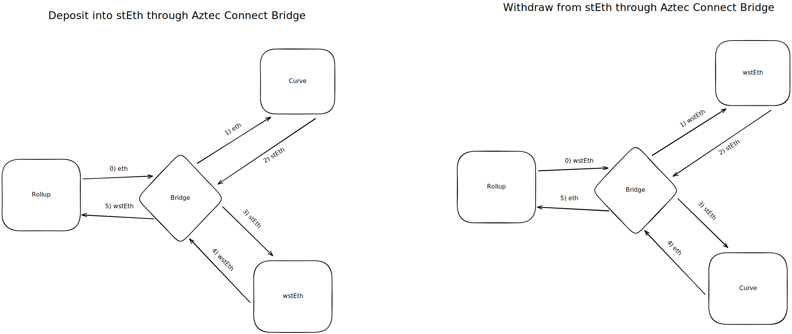

# Spec for Curve stEth Bridge

## What does the bridge do? Why build it?

The bridge swaps `eth` to `stEth` using curve to get a staked eth derivative that earns a yield from staking rewards at the beaconchain. We build it to allow users to earn yield on their eth.

## What protocol(s) does the bridge interact with ?

The bridge interacts with two protocols, namely Lido and Curve.

[Lido](https://lido.fi/) is a project that build liquid staking derivatives. They allow users to deposit stakeable assets (Eth, Sol etc) and in return get a representation of the staked asset which will grow with staking rewards. We will only be working with `stEth` (staked ether), so we will be using that for explanations going on.

`stEth` is a rebasing ERC20 token, and a users balance of it will grow/shrink based on accrued staking rewards or slashing events. After the Merge and the hardfork making it possible to withdraw staked ether from the beacon chain, `stEth` can be burned to redeem an equal amount of `eth`. Until then, `stEth` cannot be redeemed at lido directly, but can instead be traded at a secondary market, such as [curve.fi](https://curve.fi/steth).

[Curve](https://curve.fi/) is a AMM that specializes in pools with low internal volatility (stableswap). It is at the time of writing, the most liquid market for trading between `stEth` and `eth`.

## What is the flow of the bridge?

There are two flows of Curve stEth Bridge, namely deposits and withdraws.

### Deposit

If the bridge receives `eth` as the input token it will swap it on Curve to get `stEth` (NOTICE: a minimum steth/eth price is passed in the auxdata), and wrap it to `wstEth` before return the tuple `(wstEthAmount, 0, false)` and the rollup pulls the `wstEth` tokens.

The gas cost E2E for a deposit is ~250K, this is including the transfers to/from the Rollup Processor.

**Edge cases**:

- Liquidity might leave, making it impractical to perform swaps at a good rate

### Withdrawal

If the bridge receives `wstEth` as the input token, it will unwrap them to `stEth` before going to curve, where it will swap it (NOTICE: a minimum eth/wsteth is passed in the auxdata).
It will then transfer the eth received to the `ROLLUP_PROCESSOR` for the given `interactionNonce`.

The gas cost E2E for a withdraw is ~250K, this is including the transfers to/from the Rollup Processor.

**Edge cases**

- Liquidity might leave, making it impractical to perform swaps at a good rate
- If the balance of the bridge is less than the value returned by `exchange` on curve, the transaction will revet. E.g., if curve transfers fewer tokens than it tell us in the returnvalue.

### General Properties for both deposit and withdrawal

- The bridge is synchronous, and will always return `isAsync = false`.

- _Note_: Because `stEth` is rebasing, we wrap/unwrap it to `wstEth` (wrapped staked ether). This is to ensure that values are as expected when exiting from or transferring within the Rollup.

- The Bridge perform token pre-approvals in the constructor to allow the `ROLLUP_PROCESSOR`, `WRAPPED_STETH` and `CURVE_POOL` to pull tokens from it. This is to reduce gas-overhead when performing the actions. It is safe to do, as the bridge is not holding funds itself.

## Can tokens balances be impacted by external parties, if yes, how?

As we are using the wrapped variation of `stEth` it will not directly be impacted by rewards or slashing. However, the amount of `stEth` it can be unwrapped to might deviate from the expected if there has been a slashing event.

## Is the contract upgradeable?

No, the bridge is immutable without any admin role.

## Does the bridge maintain state?

No, the bridge don't maintain a state. However, it keeps an insignificant amount of token (dust) in the bridge to reduce gas-costs of future transactions. By having dust, we don't need to do a `sstore` from `0` to `non-zero`.
