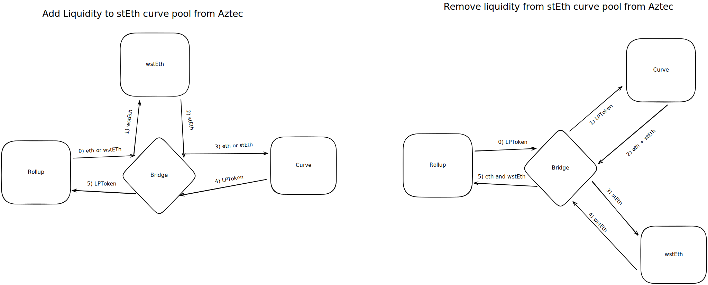

# Spec for Curve stEth LP Bridge

## What does the bridge do? Why build it?

The bridge add/remove liquidity to the curve `stEth` pool, allowing users to earn trading fees on their assets.

## What protocol(s) does the bridge interact with ?

The bridge interacts with two protocols, namely Lido and Curve.

[Lido](https://lido.fi/) is a project that build liquid staking derivatives. They allow users to deposit stakeable assets (Eth, Sol etc) and in return get a representation of the staked asset which will grow with staking rewards. We will only be working with `stEth` (staked ether), so we will be using that for explanations going on.

`stEth` is a rebasing ERC20 token, and a users balance of it will grow/shrink based on accrued staking rewards or slashing events. After the Merge and the hardfork making it possible to withdraw staked ether from the beacon chain, `stEth` can be burned to redeem an equal amount of `eth`. Until then, `stEth` cannot be redeemed at lido directly, but can instead be traded at a secondary market, such as [curve.fi](https://curve.fi/steth).

[Curve](https://curve.fi/) is a AMM that specializes in pools with low internal volatility (stableswap). It is at the time of writing, the most liquid market for trading between `stEth` and `eth`.

## What is the flow of the bridge?

There are two main flows of the Curve stEth LP Bridge, namely adding liquidity and remove liquidity.

### Deposit

The deposit can be done with either `eth` or `wstEth`. If done with `wstEth` the asset will be unwrapped before the liquidity is added to curve. Eth is added directly. In return the bridge will receive an LP token representing the position. These LP tokens are pulled by the rollup. The deposit requires the user to pass in a price that is used to compute the minimum amount of LP token for the given input asset. Note that for `wstEth` the price passed is for the underlying asset `stEth`.

### Withdrawal

The withdrawal is done by using the LP token as the input token, and will return BOTH `eth` and `wstEth` assets. The LP-token will be taken to curve, where the liquidity is removed (`eth` and `stEth` returned to bridge) and `stEth` is then wrapped to `wstEth` before it is pulled by the rollup.

**Edge cases**

- Liquidity might leave, skewing the distribution of the returned assets

### General Properties for both deposit and withdrawal

- The bridge is synchronous, and will always return `isAsync = false`.

- _Note_: Because `stEth` is rebasing, we wrap/unwrap it to `wstEth` (wrapped staked ether). This is to ensure that values are as expected when exiting from or transferring within the Rollup.

- The bridge performs token pre-approvals in the constructor to allow the `ROLLUP_PROCESSOR`, `WSTETH` and `CURVE_POOL` to pull tokens from it. This reduces gas-overhead when performing the actions. It is safe to do, as the bridge is not holding funds before or after the interaction.

## Can tokens balances be impacted by external parties, if yes, how?

As we are using the wrapped variation of `stEth` it will not directly be impacted by rewards or slashing. However, the amount of `stEth` it can be unwrapped to might deviate from the expected if there has been a slashing event.

## Is the contract upgradeable?

No, the bridge is immutable without any admin role.

## Does the bridge maintain state?

No, the bridge don't maintain a state. However, it keeps an insignificant amount of token (dust) in the bridge to reduce gas-costs of future transactions. By having dust, we don't need to do a `sstore` from `0` to `non-zero`.
