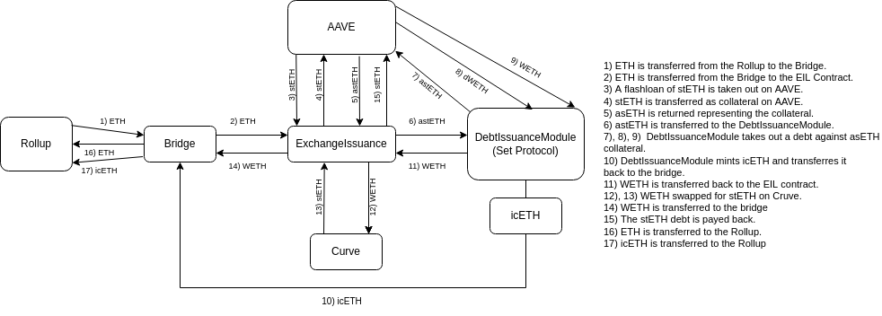
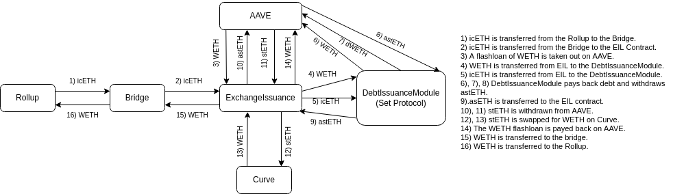
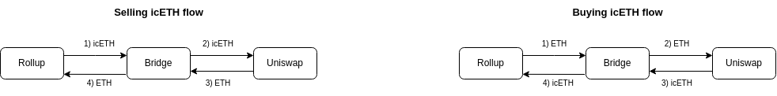

# icETH Aztec-connect Bridge

## What does this bridge do?

An Aztec-connect bridge for Interest Compounding ETH gives Aztec users the ability to enhance their staking returns while saving on gas fees.

## What protocol(s) does the bridge interact with?

The [Set Protocol](https://www.setprotocol.com/?ref=cryptocurrencyjobs.com) is used to create tokenized assets, [Interest Compounding ETH Index](https://etherscan.io/token/0x7C07F7aBe10CE8e33DC6C5aD68FE033085256A84) (icETH) is such an asset, it represents a leveraged [stETH](https://etherscan.io/token/0xae7ab96520de3a18e5e111b5eaab095312d7fe84) position. stETH is a token that represents staked ETH, the yield earned is distributed to stETH holders.

The bridge uses the [ExchangeIssuanceLeverage](https://etherscan.io/address/0xb7cc88a13586d862b97a677990de14a122b74598/advanced) (EIL) contract built by Index Coop to issue and redeem icETH tokens. The ExchangeIssuanceLeverage contract takes
care of the complexity of acquiring the tokens needed to mint and burn icETH.

The ExchangeIssuanceLeverage contract uses the liquidity protocol [AAVE](https://aave.com) to
flashloan either stETH or WETH to create or unroll a leverage stETH position
that the icETH token represents.

icETH is minted and burned through Set Protocol's [DebtIssuanceModule](https://docs.tokensets.com/developers/contracts/protocol/modules/debt-issuance-module)
that is called from the ExchangeIssuanceLeverage contract. See [Diagram 1](https://github.com/tajobin/specs/blob/main/icETH-Redeem.png)
for an overview of the flow of assets when redeeming icETH and [Diagram 2](https://github.com/tajobin/specs/blob/main/icETH-Issue.png) for
the flow when issuing.

The bridge uses Uniswap v3 when selling and buying icETH. See [Diagram 2](https://github.com/tajobin/specs/blob/main/icETH-Issue.png).

The bridge also uses [Chainlink's Oracle](https://etherscan.io/address/0x86392dC19c0b719886221c78AB11eb8Cf5c52812) stETH/ETH price feed to check that stETH:ETH swaps are done at a fair price. For icETH:ETH swaps
[Uniswaps's TWAP Oracle](https://docs.uniswap.org/protocol/concepts/V3-overview/oracle) is used instead.

## What is the flow of the bridge?

The bridge allows for 4 different synchronous interactions. In the table below you can see an overview of the input and output assets for each flow.

|                  | Issue icETH | Buy icETH | Redeem icETH | Sell ETH |
| ---------------- | ----------- | --------- | ------------ | -------- |
| **inputAssetA**  | ETH         | ETH       | icETH        | icETH    |
| **inputAssetB**  | empty       | empty     | empty        | empty    |
| **outputAssetA** | icETH       | icETH     | eth          | eth      |
| **outputAssetB** | ETH         | empty     | empty        | empty    |
| **Gas Cost**     | 1684698     | 857320    | 1780141      | 538919   |

### Auxdata

3 seperate parameters are passed in through the auxdata

- 1-32: flowSelector - Selects if we are going through EIL or if we are swapping on uniswap, it also selects the uniswap pool. 1 for going through EIL, 3 for swapping on the 0.3% pool and 5 to swap in the 0.05% pool.
- 33-48: oracleLimit - A safety feature that is either an upper or lower limit of the prices reported by an Oracles, it is set with 4 decimals. If we are buying or issuing it is the upper limit, if we are selling/redeeming it is the lower limit. If we are going through EIL it is a limit on ETH/stETH from Chainlink, if we are buying/selling on uniswap it is a limit on the ETH/icETH TWAP price. See the table below for a summary of what the oracleLimit parameter represents in the different flows.
- 49-64: maxSlip - Used to specific maximal difference between the expected return based on Oracle data and the received amount. maxSlip uses a decimal value of 4 e.g. to set the minimum discrepency to 1%, maxSlip should be set to 9900.

Table showing what oracleLimit represents in the different flows:

|             | Issue icETH              | Buy icETH           | Redeem icETH             | Sell ETH            |
| ----------- | ------------------------ | ------------------- | ------------------------ | ------------------- |
| Oracle Data | ETH/stETH from Chainlink | ETH/icETH from TWAP | ETH/stETH from Chainlink | ETH/stETH from TWAP |
| Limit       | Upper                    | Upper               | Lower                    | Lower               |

### Cases that that would make the interaction revert

1. Revert if the caller is not the rollup.
2. Revert if the input amount is too small when issuing/redeeming.
3. Revert if the flowSelector in the auxdata is not 3 or 5.
4. Revert if the input and output assets are not correct.
5. Revert if the Chainlink price is deemed unsafe.
6. Revert if the TWAP price is deemed unsafe.
7. Revert if there is not enough liquidity on uniswap.
8. Revert if there is not enough liquidity on Cruve.

### Diagrams of the flow of assets

|       _Diagram 1_: Issue Flow       |
| :---------------------------------: |
|  |

|       _Diagram 2_: Redeem Flow       |
| :----------------------------------: |
|  |

|       _Diagram 3_: Buy/Sell Flow       |
| :------------------------------------: |
|  |

## Edge cases that may restrict the usefulness of the bridge or that the bridge prevents explicit.

The uniswap pools currently have a cardinality of 1 which restricts the usefulness of the TWAP oracle. To make the TWAP oracle useful the cardinality of the uniswap pool has to be expanded before this bridge is deployed. The bridge is currently set to calculate the TWAP over 10s simply to be able to run tests but after the cardinality is expanded this variable has to be altered to reflect those changes.

The stETH curve pool is currently unbalanced and it is therefore often not possible to swap stETH->WETH. As long as this is the case it will not be possible to redeem icETH since it requires a swap from stETH->WETH to repay a flashlaon. Users will therefore have to use the sell flow on uniswap if they wish to exchange their icETH for ETH.

## How can the accounting of the bridge be impacted by interactions performed by other parties than the bridge?

Index Coop has their own infrastructure dealing with rebalancing. The safe range is set to 3.0x-3.2x, an automatic keeper system monitors the position and triggers a rebalancing event if the price de-pegs. There is also an additional [ripcord](https://docs.indexcoop.com/our-products/flexible-leverage-indices/fli-technical-documentation/fli-product-parameters#ripcord-parameters) feature that can be called by anybody if the leverage ratio exceeds 3.3x.

The recent volatility and stETH:ETH de-peg required multiple rebalancing events. Index Coop has written about the event [here](https://indexcoop.com/blog/iceth-and-index-coop-addressing-market-volatility).

## Is this contract upgradable?

The contract is not upgradable.

## Does this bridge maintain state?

Nothing is stored on the contract.
